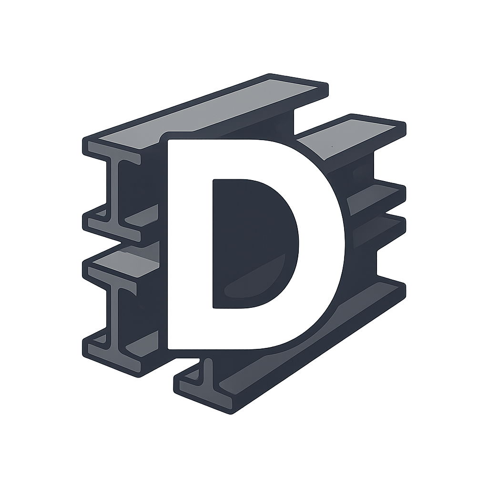

\section intro Introduction
Welcome to the official **Dexium** Wiki.
Dexium is a lightweight, modular rendering and game framework written in C++ with an emphasis on **low-level control** and **extensibility** while providing high-level tools.

This core ideology of **Dexium** allows for a robust engine that introduces OpenGL concepts and features to programmers with little to no knowledge of rendering API's through high-level abstractions. While also leaving the belly of the engine exposed for power-users and hackers alike to easily pick up an engine with low-level tools reduce boilerplate of your next game/rendering project.

**Dexium** used to use SDL2 for its window and rendering backend, but with the experimental tools I was making at the time, it was evident that there was a need for me to also support 3D rendering using these tools
Therefore, Dexium now solely runs on OpenGL for its rendering API and GLFW for window management. SDL2 is fully deprecated(SDL rendering). However, you can optionally choose to use a SDL2/3 window for window management. Refer to [Window Management](_docs/Window.md)

This Wiki aims to provide full documentation and tutorials for **Dexium**

\section mission Inspiration & Mission
What heavily inspired me to write my own game engine/framework is that i spent some time dabbling in Unity and even more in Godot
but coming from the world of Python and Pygame and jumping head first into C++ and SDL2 I found that there aren't many great API's out there
that just let you link to a library and build prototypes or impressive indie style games while also allowing you to dabble with the udnerlying render API
just to learn something new or because you simpily aren't happy with the tools provided out of the box.

I know that if you ask in forums or communities "How can I replace/improve this function?" your often met with the age-old,
'Well, if it doesn't suit you, find another library' statement. As many libraries and higher-level API's don't expose much of their foundations.
I am an avid prorgammer at heart and find the 'cookie-clicker' boierplate of modern game engines to actually detract from my cerative processes

So in my attempt to broaden my understanding of modern C++, game engine architecture and OpenGL I dived into this project. **Dexium**

Looking back on the development of this project, Ic ans ee how my early attempts at 2D games using SDL2 really pushed me in this direction.
Where I were often re-writing window and event code for my various games I attempted to make. hese frustrations culminated into eventaully dweveliping a SDL2 window and event manager.
When I found how useful it was to actually batch and re-use my code in such a system-like way, I slowly began writing more systems that would handle GUI, sprites, spritesheets, rigid-bodies and basic physcis.
I then decided that 2D graphics is far too boring. I was watching YouTubers like *ThinMatrix* & *Sebastion Lague* who were making cozy indie games or awesome simulations
using 3D graphics and rendering techniques. So I spent some time learning the basics of Godot. I really enjoyed the Node system that did away with that awful Scene system used in many otehr engines.
I also found it rather difficult to be writing code snuippets for a cookie-clicker engine without actually understanding the underlying mechanins or even ebing able to poke and prod at them.

It's also important to note that currently, this project is a passion project, solely carried out by myself and that it may not be very efficient or
easy for entry-level programmers to use. BUt i do intend to work on these issues where I can.

Currently **Dexium** is in alpha development and there are no offical releases. Therefore, you should the occasional breaking changes
to the code-base and for entire sections/systems of the engine to be modified without any notice.

\section getting_started Getting Started
- [Introduction](getting_started.html)
- [Installation](install.html)

These pages will help you install Dexium, configure your environment and start building your first project

\section tutorials Tutorials 📚
Step-by-step guides and examples that walk you through common use-cases and configurations.

I relied heavily on various online tutorials and wiki's in support of learning OpenGL and engine architecture frameworks.
In particular, I found the below OpenGL tutorials really informative and therefore, I want to build my wiki in a similar fasion while also providing full documentation for my engine

- The GOAT of OpenGL tutorials on the inter-webs: [LearnOpenGL](https://learnopengl.com/)
I cannot thank *Joey De Vrius* enough for providing such great tutorials and learning opportunities through his website

The tutorials provided are broken down into smaller chapters that will walk you through how to use different Dexium systems
to build and render your first video game through Dexium

Then a 2D and 3D tutorial to amke two seperate video games will also be published at the bottom of the tutorials

If you haven't already set up Dexium and your new project, I suggest you visit [Getting Started](getting_started.md) before jumping into the first tutorial

	
Click to expand tutorial list

- <a href="tutorials/tut_1_hello_window.md" title="Learn how to open your first Dexium window and render a blank scene.">1. Hello Window!</a>
- <a href="tutorials/tut_2_vfs.md" title="Understand Dexium's Virtual File System">2. The power of VFS</a>
- <a href="tutorials/tut_3_assets.md" title="Learn how to laod, manage and hot-relaod assets in Dexium">3. Asset Galore</a>
- <a href="tutorials/tut_4_camera.md" title="Learn all about Dexiums Camera systems">4. Cameras</a>
- <a href="tutorials/tut_5_mesh.md" title="Render your first triangle and understand Dexium meshes">5. Illumanti</a>
- <a href="tutorials/tut_6_sprite.md" title="Create and move sprites around with transforms and materials">6. Sprites & Movement</a>
- <a href="tutorials/tut_7_spritesheet.md" title="Optimize rendering using spritesheets and texture atlas's">7. Spritesheets</a>
- <a href="tutorials/tut_8_going_3d.md" title="From 2D to 3D rendering - taking your first steps.">8. Going 3D</a>
- <a href="tutorials/tut_9_shaders.md" title="Delve into the world of GLSL and connecting them to Dexium">9. Ma, the LSD!</a>

\section notes Notes
- This Wiki is generated using **Doxygen** and **Markdown**
- All tutorials & guides live in 'docs/src/'.
- Code snippets are written in C++ (unless otherwise specified).

Dexium is proudly made by Dextron12. Checkout my [GitHub](https://github.com/Dextron12)

All contributions are supported. Open an issue or pull/merge request for your contributions.

    

